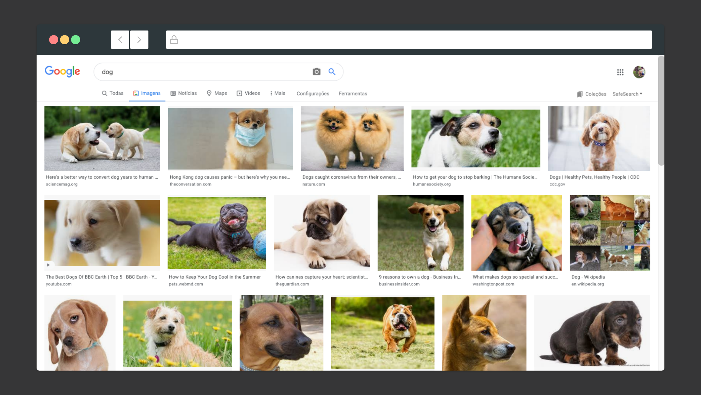

# Download images from google

- This is a selenium bot that automatically downloads images from google by providing a string and a number of image to download string



## Install

- [node](https://nodejs.org/en/download/)

- [yarn](https://classic.yarnpkg.com/en/docs/install/#mac-stable)

- install packages

```sh
yarn
```

## Usage

- after install everything, simply by typing

```sh
yarn start -s <string to search> -n <number of images to download>
```